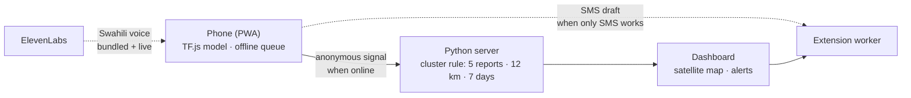

# CropSignal

**Small AI that works where the internet doesn't.** CropSignal is an offline-first web app that lets a coffee farmer check a leaf on their phone, and turns anonymous field signals into an early-warning map for agricultural extension workers.

> **Live demo:** <https://agriculture-smallai.onrender.com/> · Farmer app: `/` · Extension dashboard: `/dashboard.html`
> (Free hosting sleeps when idle, so the first visit can take 30–60 s to wake up.)

---

## The problem

In coffee-growing communities, a disease that nobody reports can become an epidemic. Leaf rust, Cercospora, leaf miner and Phoma spread across a hillside in days, but the people who see the first symptoms often have **no signal, no agronomist nearby, and no way to alert anyone**. Extension teams, meanwhile, only learn about outbreaks when they are already large.

## The solution

CropSignal closes that loop with three pieces that all run on cheap hardware:

1. **A private, on-device check.** A farmer photographs one leaf. A 1.7 MB MobileNetV2 model runs *in the browser* (TensorFlow.js) and returns a screening result plus practical next steps: what to inspect, what to monitor, and what *not* to do. No connection is needed and the photo never leaves the phone.
2. **An anonymous signal.** If the result is confident enough, the farmer can save a tiny report (label, confidence, time, ~1 km location). It waits in a local queue and syncs by itself when any connection returns. Where only SMS works, the app drafts a short message for the extension worker.
3. **An early-warning dashboard.** The server clusters matching signals in space and time. When five similar reports appear within 12 km over seven days, the dashboard flags a zone: **verify here first.** A qualified extension worker then visits, confirms, and decides on any advice.



## Features

| Area | What it does |
|---|---|
| **On-device AI** | Five-class Arabica coffee-leaf classifier (Cercospora, healthy/no supported condition, leaf rust, leaf miner, Phoma) running in the browser with TensorFlow.js. |
| **Truly offline** | A service worker caches the page, the model weights and the audio. Each file is cached and validated separately, and the top bar shows **“ready for offline use ✓”** once everything is stored. |
| **Honest uncertainty** | Results below **60 %** confidence are labelled *Uncertain*, come with re-check instructions, and **cannot be saved as a community report**. |
| **Practical guidance** | “Do now / Monitor / Avoid” steps per condition, in English and **Kiswahili (pilot)**. The app never recommends spraying from a screen alone. |
| **Voice guidance** | Live **ElevenLabs** voice when online, bundled pre-generated Kiswahili clips when offline, and the phone's own voice as a last resort. A **Stop** button ends playback at any time. |
| **Offline queue + auto-sync** | Reports are stored on the device and sent automatically (retry every few seconds, and on reconnect). Each report is removed from the queue only after the server accepts it. |
| **SMS fallback** | *Prepare SMS report* drafts a short anonymous message for an extension worker. On a phone it opens the messaging app; on desktop it shows the text with a copy button. The farmer decides whether to send it. |
| **Camera or gallery** | Separate *Take a photo* and *Choose from gallery* buttons. |
| **Extension dashboard** | Satellite/street map (Leaflet), outbreak zones, “what farmers observed”, a recommended next step and a Kiswahili alert **draft** for human review. Nothing is sent automatically. |

## Try it in two minutes (for judges)

1. Open <https://agriculture-smallai.onrender.com/> in **Chrome** with a connection and wait for **“Connected · ready for offline use ✓”** in the top bar. (The very first visit has to download the app once; after that it is stored on the device.)
2. Tap **Try coffee-rust demo**. The model runs in your browser and flags leaf rust. Or use **Choose from gallery** with a photo from [`data/coffee-pilot/`](data/coffee-pilot) (for example `Leaf_rust/000.jpg`).
3. Switch the language to **Kiswahili · pilot** and tap **▶ Hear guidance** (tap **■ Stop** to end it).
4. **Test offline:** turn on airplane mode, reload, analyze another photo, and tap **Save anonymous report**. It appears in the offline queue.
5. Turn the connection back on. The queue empties by itself within a few seconds.
6. Tap **Prepare SMS report** to see the SMS fallback draft.
7. Open the **Extension dashboard**, tap **Show coffee-rust demo**, and watch the alert banner, the map zoom to the zone, and the action queue.

## How it works

### The model

| | |
|---|---|
| Backbone | ImageNet-pretrained **MobileNetV2** (alpha 0.35), frozen |
| Head | Global pooling → Dropout 0.25 → Dense(5, softmax) |
| Input | 160 × 160 RGB, scaled to [−1, 1] |
| Size | ≈ 1.7 MB of TF.js weights (`model-coffee-v1/`) |
| Classes | `Cerscospora`, `Healthy`, `Leaf_rust`, `Miner`, `Phoma` |
| Data | 40 images per class (200 total) drawn from the JMuBEN / JMuBEN2 Arabica dataset collected at Mutira, Kirinyaga County, Kenya |
| Abstention | Top-1 probability < 0.60 → *Uncertain*, no report allowed |

> **Read this before quoting a number.** The 100 % held-out score in [`artifacts/coffee-mvp/metrics.json`](artifacts/coffee-mvp/metrics.json) comes from a small *development* split of a public dataset that is known to contain duplicates. It is **not** a field validation and must not be presented as real-world accuracy. See the [model card](COFFEE_MODEL_CARD.md).

### Outbreak rule

Deliberately simple, explainable and deterministic (`detect_outbreaks` in [`server.py`](server.py)):

- group reports from the last **7 days** with the **same label**;
- measure distance with the **Haversine** formula on rounded coordinates;
- flag a zone when **≥ 5** matching reports fall within **12 km**.

The dashboard calls these *statistical signals*, not confirmed outbreaks.

### Privacy by design

| Leaves the phone | Never leaves the phone |
|---|---|
| Diagnosis label | The photo |
| Model confidence | The farmer's name or contact details |
| Timestamp | Precise GPS (coordinates are rounded to 2 decimals, ≈ 1 km, *before* sending) |
| Optional observations (spreading, wet, more than one plant, marks under the leaf) | |

### Voice

`Hear guidance` tries, in order: **(1)** a live ElevenLabs voice through the server's `/api/tts` endpoint, **(2)** bundled, pre-generated Kiswahili clips in [`audio/`](audio) that work offline, **(3)** the phone's installed voice. The ElevenLabs key lives **only on the server**; the endpoint is rate-limited (12 requests/min per IP) and caches generated audio on disk.

## Run it locally

Requires **Python 3.10+**. The server uses only the standard library: nothing to install.

```bash
python server.py
```

Open <http://localhost:8000> (farmer app) and <http://localhost:8000/dashboard.html> (dashboard). `localhost` counts as a secure context, so the service worker and offline mode work.

### Configuration (environment variables)

| Variable | Default | Purpose |
|---|---|---|
| `PORT` | `8000` | Port to listen on |
| `HOST` | `127.0.0.1` | Bind address (the Docker image sets `0.0.0.0`) |
| `ELEVENLABS_API_KEY` | – | Enables live ElevenLabs voice. Optional: without it, the app falls back to the bundled clips and the phone voice |
| `ELEVENLABS_VOICE_ID` | `JBFqnCBsd6RMkjVDRZzb` | Voice used for live and generated audio |

PowerShell example:

```powershell
$env:ELEVENLABS_API_KEY = "your-key"   # never commit this
python server.py
```

### Deploy

The repo ships a [`Dockerfile`](Dockerfile) and a [`render.yaml`](render.yaml). On [Render](https://render.com): **New → Web Service**, connect the repo, choose **Docker** and the **Free** instance, then add `ELEVENLABS_API_KEY` as an environment variable. Any HTTPS host works; HTTPS is required for service workers and offline mode.

> The free tier has an ephemeral filesystem, so stored reports reset on restart. *Show coffee-rust demo* regenerates the demo data.

## API

| Method & path | Description |
|---|---|
| `GET /api/reports` | All stored anonymous reports |
| `GET /api/outbreaks` | Detected zones plus the active rule (`radiusKm`, `windowDays`, `minimumReports`) |
| `POST /api/reports` | Validate and store one report (label, confidence, rounded lat/lon, observations, language) |
| `POST /api/tts` | `{ "text": "…" }` → `audio/mpeg` via ElevenLabs (rate-limited, cached) |
| `POST /api/seed` | Load the coffee-rust demo scenario (replaces only previous `demo-*` rows) |
| `POST /api/reset` | Clear all stored reports (demo utility) |

## Repository map

```text
index.html · app.js          Farmer PWA: camera/gallery, TF.js inference, guidance, voice, SMS draft, offline queue
dashboard.html · dashboard.js  Extension dashboard: Leaflet map, outbreak alerts, Kiswahili draft
server.py                    Standard-library API, outbreak detector, ElevenLabs proxy
sw.js · manifest.webmanifest Service worker (validated per-file cache) and PWA manifest
knowledge-base.js            Per-condition “Do now / Monitor / Avoid” guidance
model-coffee-v1/             Shipped TF.js model and label map
audio/                       Pre-generated Kiswahili clips (ElevenLabs)
training/                    Reproducible data download, training and TF.js export scripts
artifacts/coffee-mvp/        Keras checkpoints, label map and development metrics
data/coffee-pilot/           The 200-image development subset used for training
test-images/                 Sample leaf for the built-in demo button
vendor/tf.min.js             TensorFlow.js runtime, bundled for offline use
COFFEE_MODEL_CARD.md         Intended use, data, evaluation and safeguards
MODEL_CARD.md                Legacy PlantVillage experiment, kept for provenance
model/ · model-multicrop*/   Earlier experiments, not loaded by the current app
```

### Reproduce the model

```bash
pip install -r training/requirements-colab.txt
python training/download_coffee_pilot.py --per-class 40
python training/train_coffee_mvp.py
python training/export_tfjs.py --keras artifacts/coffee-mvp/coffee_mvp.keras \
    --labels artifacts/coffee-mvp/class_indices.json --output model-coffee-v1
```

To regenerate the Kiswahili clips (requires `ELEVENLABS_API_KEY`): `python training/generate_voice_prompts.py`.

## What was hard

- **Making offline real, not hopeful.** A single failed file used to break the entire service-worker install, and tunnels such as ngrok can answer with an HTML interstitial that gets cached as if it were a script. The cache now fetches each file separately, rejects responses that are not the real file, serves an app-shell fallback for offline navigation, and reports “ready for offline use ✓” only once the model, page and audio are stored.
- **Safe behaviour with little data.** A model trained on 40 photos per class should not speak with false confidence. The app abstains below 60 %, refuses to share low-confidence signals, and frames every output as a screening hint.
- **Useful signal without exposing anyone.** Only coarse, anonymous fields are shared, and an alert needs five matching reports, so a single wrong photo can't trigger one.

## Limitations and safety

- **Not a diagnosis.** CropSignal is a screening aid and a prioritisation signal. A qualified extension worker must verify before any treatment advice.
- **The metric is a development split**, not field validation, and the public dataset has known duplicates. A real pilot needs consented local photos, de-duplication by leaf and farm, evaluation by farm and location, and agronomist-reviewed labels.
- **Five classes only.** Other crops, pests, nutrient deficiencies or unseen diseases are out of scope (the app should answer *Uncertain*).
- **Kiswahili guidance is a prototype** and needs native-speaker and agronomist review before real use.
- **Reports are not authenticated.** Anyone could send a signal, and `/api/seed` and `/api/reset` are open demo utilities. Production needs authentication, rate limits, encryption, audit logs and data governance.
- **The SMS is a draft**, not a gateway: the farmer sends it from their own phone.
- **The satellite map needs a connection**, since tiles are fetched online. Everything in the farmer app works offline after the first visit.

## Roadmap

1. Pilot with real farms and extension workers; collect consented local images and evaluate by farm and location.
2. Native-speaker review of Kiswahili guidance and more languages.
3. Authentication and authorised extension accounts; a real SMS gateway.
4. Persistent storage and per-region alert thresholds.
5. More crops, each with its own validated model and model card.

## Credits

- **Data:** Jepkoech et al. (2021), *Arabica coffee leaf images dataset for coffee leaf disease detection and classification*, Data in Brief 36, 107142. [JMuBEN](https://doi.org/10.17632/t2r6rszp5c.1) and [JMuBEN2](https://doi.org/10.17632/tgv3zb82nd.1), republished as `Project-AgML/arabica_coffee_leaf_disease_classification`. Verify the original licence terms before any production use.
- **Built with:** TensorFlow / Keras, TensorFlow.js, Leaflet, Esri World Imagery and OpenStreetMap tiles, ElevenLabs text-to-speech, and the Python standard library.
- **Author:** Mihail Stankevich · [LinkedIn](https://www.linkedin.com/in/mihail-stankevich/). Built for the Hack Nation hackathon.
